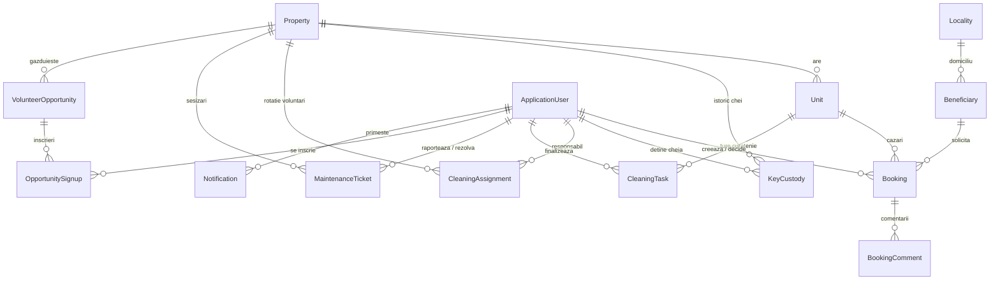

# Schema bazei de date — Emaus

Modelul de mai jos e generat direct din entitățile EF Core din `Domain/Entities`
și mapează exact fluxurile din planul aplicației, plecând de la structura folosită azi
în „Programare cazări.xlsx”.

## Diagramă (entitate-relație)

## Decizii de design și de ce

**Property vs. Unit, pe două niveluri.** În Excel, o adresă (ex. „Traian Popovici 132, ap28”)
poate conține două unități cazabile separate — „dormitor” și „sufragerie” — fiecare cu status
propriu de ocupare, dar cu **o singură** listă de chei și un **singur** ciclu de curățenie
pentru toată adresa. De-asta chei (`KeyCustody`), rotația de curățenie (`CleaningAssignment`)
și sesizările de mentenanță (`MaintenanceTicket`) atârnă de `Property`, iar statusul de
ocupare (`UnitStatus`) și rezervările (`Booking`) atârnă de `Unit`. Pentru o adresă cu o
singură unitate cazabilă, pur și simplu `Property` are un singur `Unit` copil.

**`Locality` ca tabel separat, nu text liber.** Azi „Bacau” și „Bacău” apar ca valori diferite
în coloana de domiciliu, ceea ce strică orice statistică geografică. Un tabel de localități
(populat o singură dată) elimină problema; `LocalityFreeText` rămâne ca supapă pentru cazuri
din afara listei (beneficiari din altă țară, ca cei din Ucraina văzuți în evidență).

**`CleaningAssignment` (abonament) separat de `CleaningTask` (tură concretă).** Primul e
lista rotativă de responsabili ai unei adrese (ca azi, „Responsabil 1..4”); al doilea e
apariția reală care se deschide automat când o unitate intră în `NeedsCleaning` — de obicei
la check-out — și se închide când cineva o marchează `Done`.

**Perioadă solicitată vs. realizată, ca azi.** `Booking` ține `RequestedCheckIn/Out` separat
de `ActualCheckIn/Out`, pentru că în evidența actuală cele două diferă frecvent (cineva cere
3 zile și rămâne 12).

**`BookingComment` ca tabel propriu, nu un câmp text pe `Booking`.** Fluxul cere un fir de
discuție al nucleului înainte de decizie, cu autor și dată per mesaj — un singur câmp de
observații l-ar fi pierdut.

**Date sensibile izolate, nu ascunse structural.** `MaterialSituation` și `Notes` de pe
`Beneficiary` rămân câmpuri normale în schemă — restricția de acces (doar rolul `Nucleus` le
vede) se aplică la nivel de API/UI, nu prin tabele separate, ca să nu complice inutil schema
înainte să existe o cerință clară de audit pe ele.

**Fără tabel de `Address`/geocodare încă.** Nu era în cerințe și ar adăuga complexitate
(validare, hărți) fără beneficiu clar în faza 1 — de reluat dacă apare nevoia unei hărți cu
toate locațiile.

## Ce nu ține baza de date (validat la nivel de aplicație)

- **Suprapunerea intervalelor** pe aceeași `Unit` — EF Core/SQL nu exprimă direct „fără
  interval suprapus”; se verifică în serviciul de creare a rezervării înainte de aprobare.
- **Tranzițiile de status** (ex. o unitate `Occupied` nu poate sări direct în `Available` fără
  să treacă prin `NeedsCleaning`) — regulă de business, nu constrângere de schemă.

## Următorul pas tehnic

1. `dotnet ef migrations add InitialCreate` odată ce proiectul Web API e inițializat în jurul
   acestor fișiere.
2. Un script de seed pentru `Locality` (localitățile din România) și pentru cele ~8 proprietăți
   deja folosite de Emaus, ca migrarea din Excel să înceapă cu locațiile deja definite.
3. Un `ApplicationUser` inițial cu rol `Nucleus`, ca prim cont din care se creează restul.
